# Sage API
> Generated by [`prisma-markdown`](https://github.com/samchon/prisma-markdown)

- [default](#default)

## default

```mermaid
erDiagram
"User" {
  String id PK
  String email UK
  Boolean email_verified
  String username UK
  String given_name
  String family_name
  String avatar_url
  String last_ip "nullable"
  DateTime last_login "nullable"
  Int login_count
  DateTime last_password_reset "nullable"
  Boolean blocked
  String blocked_for
  Json profile "nullable"
  DateTime created_at
  DateTime updated_at
}
"Identity" {
  String id PK
  String type
  String provider
  String subject
  String password_hash "nullable"
  String access_token "nullable"
  String refresh_token "nullable"
  Json profile_data "nullable"
  Json multifactor "nullable"
  String user_id FK "nullable"
  DateTime created_at
  DateTime updated_at
}
"Org" {
  String id PK
  Json name "nullable"
  String slug UK
  Json desc "nullable"
  String avatar_url "nullable"
  String website_url "nullable"
  DateTime created_at
  DateTime updated_at
}
"OrgsUsers" {
  String user_id FK
  String org_id FK
  DateTime created_at
}
"OrgHistory" {
  String org_id FK
  DateTime datetime
  String user_id FK
  Json original "nullable"
  Json changes "nullable"
}
"Region" {
  String id PK
  Json name "nullable"
  DateTime created_at
  DateTime updated_at
}
"RegionHistory" {
  String region_id FK
  DateTime datetime
  String user_id FK
  Json original "nullable"
  Json changes "nullable"
}
"Place" {
  String id PK
  Json name "nullable"
  Json address "nullable"
  Json desc "nullable"
  DateTime created_at
  DateTime updated_at
}
"PlaceTag" {
  String place_id FK
  String tag_name
  DateTime created_at
  DateTime updated_at
}
"PlaceHistory" {
  String place_id FK
  DateTime datetime
  String user_id FK
  Json original "nullable"
  Json changes "nullable"
}
"Category" {
  String id PK
  Json name "nullable"
  Json desc_short "nullable"
  Json desc "nullable"
  String image_url "nullable"
  DateTime created_at
  DateTime updated_at
}
"CategoryTree" {
  String ancestor_id FK
  String descendant_id FK
  Int length
}
"CategoryHistory" {
  String category_id FK
  DateTime datetime
  String user_id FK
  Json original "nullable"
  Json changes "nullable"
}
"Item" {
  String id PK
  Json name "nullable"
  Json desc "nullable"
  Json source "nullable"
  Json tags "nullable"
  Json files "nullable"
  Json links "nullable"
  Json certifications "nullable"
  String region_id FK "nullable"
  DateTime created_at
  DateTime updated_at
}
"ItemsCategories" {
  String item_id FK
  String category_id FK
  DateTime created_at
}
"ItemsOrgs" {
  String item_id FK
  String org_id FK
  DateTime created_at
}
"ItemHistory" {
  String item_id FK
  DateTime datetime
  String user_id FK
  Json original "nullable"
  Json changes "nullable"
}
"Variant" {
  String id PK
  Json name "nullable"
  Json desc "nullable"
  Json source "nullable"
  Json tags "nullable"
  String item_id FK
  String region_id FK "nullable"
  DateTime created_at
  DateTime updated_at
}
"VariantOrgs" {
  String variant_id FK
  String org_id FK
  DateTime created_at
}
"VariantsComponents" {
  String variant_id FK
  String component_id FK
  DateTime created_at
}
"VariantHistory" {
  String variant_id FK
  DateTime datetime
  String user_id FK
  Json original "nullable"
  Json changes "nullable"
}
"Component" {
  String id PK
  Json name "nullable"
  Json desc "nullable"
  Json source "nullable"
  Json residential_stream "nullable"
  Json local_stream "nullable"
  Json commercial_stream "nullable"
  Boolean hazardous
  Json hazardous_info "nullable"
  String region_id FK "nullable"
  String material_id FK
  DateTime created_at
  DateTime updated_at
}
"ComponentsMaterials" {
  String component_id FK
  String material_id FK
  DateTime created_at
}
"ComponentsProcesses" {
  String component_id FK
  String process_id FK
  DateTime created_at
}
"ComponentHistory" {
  String component_id FK
  DateTime datetime
  String user_id FK
  Json original "nullable"
  Json changes "nullable"
}
"Material" {
  String id PK
  Json name "nullable"
  Json desc "nullable"
  Json source "nullable"
  Boolean technical
  DateTime created_at
  DateTime updated_at
}
"MaterialHistory" {
  String material_id FK
  DateTime datetime
  String user_id FK
  Json original "nullable"
  Json changes "nullable"
}
"Process" {
  String id PK
  Json name "nullable"
  Json desc "nullable"
  Json source "nullable"
  String material_id FK
  String region_id FK "nullable"
  DateTime created_at
  DateTime updated_at
}
"ProcessHistory" {
  String process_id FK
  DateTime datetime
  String user_id FK
  Json original "nullable"
  Json changes "nullable"
}
"Identity" }o--o| "User" : user
"OrgsUsers" }o--|| "User" : user
"OrgsUsers" }o--|| "Org" : org
"OrgHistory" }o--|| "Org" : org
"OrgHistory" }o--|| "User" : user
"RegionHistory" }o--|| "Region" : region
"RegionHistory" }o--|| "User" : user
"PlaceTag" }o--|| "Place" : place
"PlaceHistory" }o--|| "Place" : place
"PlaceHistory" }o--|| "User" : user
"CategoryTree" }o--|| "Category" : ancestor
"CategoryTree" }o--|| "Category" : descendant
"CategoryHistory" }o--|| "Category" : category
"CategoryHistory" }o--|| "User" : user
"Item" }o--o| "Region" : region
"ItemsCategories" }o--|| "Item" : item
"ItemsCategories" }o--|| "Category" : category
"ItemsOrgs" }o--|| "Item" : item
"ItemsOrgs" }o--|| "Org" : org
"ItemHistory" }o--|| "Item" : item
"ItemHistory" }o--|| "User" : user
"Variant" }o--|| "Item" : item
"Variant" }o--o| "Region" : region
"VariantOrgs" }o--|| "Variant" : variant
"VariantOrgs" }o--|| "Org" : org
"VariantsComponents" }o--|| "Variant" : variant
"VariantsComponents" }o--|| "Component" : component
"VariantHistory" }o--|| "Variant" : variant
"VariantHistory" }o--|| "User" : user
"Component" }o--o| "Region" : region
"Component" }o--|| "Material" : primary_material
"ComponentsMaterials" }o--|| "Component" : component
"ComponentsMaterials" }o--|| "Material" : material
"ComponentsProcesses" }o--|| "Component" : component
"ComponentsProcesses" }o--|| "Process" : process
"ComponentHistory" }o--|| "Component" : component
"ComponentHistory" }o--|| "User" : user
"MaterialHistory" }o--|| "Material" : material
"MaterialHistory" }o--|| "User" : user
"Process" }o--|| "Material" : material
"Process" }o--o| "Region" : region
"ProcessHistory" }o--|| "Process" : process
"ProcessHistory" }o--|| "User" : user
```

### `User`

**Properties**
  - `id`: 
  - `email`: 
  - `email_verified`: 
  - `username`: 
  - `given_name`: 
  - `family_name`: 
  - `avatar_url`: 
  - `last_ip`: 
  - `last_login`: 
  - `login_count`: 
  - `last_password_reset`: 
  - `blocked`: 
  - `blocked_for`: 
  - `profile`: 
  - `created_at`: 
  - `updated_at`: 

### `Identity`

**Properties**
  - `id`: 
  - `type`: 
  - `provider`: 
  - `subject`: 
  - `password_hash`: 
  - `access_token`: 
  - `refresh_token`: 
  - `profile_data`: 
  - `multifactor`: 
  - `user_id`: 
  - `created_at`: 
  - `updated_at`: 

### `Org`

**Properties**
  - `id`: 
  - `name`: 
  - `slug`: 
  - `desc`: 
  - `avatar_url`: 
  - `website_url`: 
  - `created_at`: 
  - `updated_at`: 

### `OrgsUsers`

**Properties**
  - `user_id`: 
  - `org_id`: 
  - `created_at`: 

### `OrgHistory`

**Properties**
  - `org_id`: 
  - `datetime`: 
  - `user_id`: 
  - `original`: 
  - `changes`: 

### `Region`

**Properties**
  - `id`: 
  - `name`: 
  - `created_at`: 
  - `updated_at`: 

### `RegionHistory`

**Properties**
  - `region_id`: 
  - `datetime`: 
  - `user_id`: 
  - `original`: 
  - `changes`: 

### `Place`

**Properties**
  - `id`: 
  - `name`: 
  - `address`: 
  - `desc`: 
  - `created_at`: 
  - `updated_at`: 

### `PlaceTag`

**Properties**
  - `place_id`: 
  - `tag_name`: 
  - `created_at`: 
  - `updated_at`: 

### `PlaceHistory`

**Properties**
  - `place_id`: 
  - `datetime`: 
  - `user_id`: 
  - `original`: 
  - `changes`: 

### `Category`

**Properties**
  - `id`: 
  - `name`: 
  - `desc_short`: 
  - `desc`: 
  - `image_url`: 
  - `created_at`: 
  - `updated_at`: 

### `CategoryTree`

**Properties**
  - `ancestor_id`: 
  - `descendant_id`: 
  - `length`: 

### `CategoryHistory`

**Properties**
  - `category_id`: 
  - `datetime`: 
  - `user_id`: 
  - `original`: 
  - `changes`: 

### `Item`

**Properties**
  - `id`: 
  - `name`: 
  - `desc`: 
  - `source`: 
  - `tags`: 
  - `files`: 
  - `links`: 
  - `certifications`: 
  - `region_id`: 
  - `created_at`: 
  - `updated_at`: 

### `ItemsCategories`

**Properties**
  - `item_id`: 
  - `category_id`: 
  - `created_at`: 

### `ItemsOrgs`

**Properties**
  - `item_id`: 
  - `org_id`: 
  - `created_at`: 

### `ItemHistory`

**Properties**
  - `item_id`: 
  - `datetime`: 
  - `user_id`: 
  - `original`: 
  - `changes`: 

### `Variant`

**Properties**
  - `id`: 
  - `name`: 
  - `desc`: 
  - `source`: 
  - `tags`: 
  - `item_id`: 
  - `region_id`: 
  - `created_at`: 
  - `updated_at`: 

### `VariantOrgs`

**Properties**
  - `variant_id`: 
  - `org_id`: 
  - `created_at`: 

### `VariantsComponents`

**Properties**
  - `variant_id`: 
  - `component_id`: 
  - `created_at`: 

### `VariantHistory`

**Properties**
  - `variant_id`: 
  - `datetime`: 
  - `user_id`: 
  - `original`: 
  - `changes`: 

### `Component`

**Properties**
  - `id`: 
  - `name`: 
  - `desc`: 
  - `source`: 
  - `residential_stream`: 
  - `local_stream`: 
  - `commercial_stream`: 
  - `hazardous`: 
  - `hazardous_info`: 
  - `region_id`: 
  - `material_id`: 
  - `created_at`: 
  - `updated_at`: 

### `ComponentsMaterials`

**Properties**
  - `component_id`: 
  - `material_id`: 
  - `created_at`: 

### `ComponentsProcesses`

**Properties**
  - `component_id`: 
  - `process_id`: 
  - `created_at`: 

### `ComponentHistory`

**Properties**
  - `component_id`: 
  - `datetime`: 
  - `user_id`: 
  - `original`: 
  - `changes`: 

### `Material`

**Properties**
  - `id`: 
  - `name`: 
  - `desc`: 
  - `source`: 
  - `technical`: 
  - `created_at`: 
  - `updated_at`: 

### `MaterialHistory`

**Properties**
  - `material_id`: 
  - `datetime`: 
  - `user_id`: 
  - `original`: 
  - `changes`: 

### `Process`

**Properties**
  - `id`: 
  - `name`: 
  - `desc`: 
  - `source`: 
  - `material_id`: 
  - `region_id`: 
  - `created_at`: 
  - `updated_at`: 

### `ProcessHistory`

**Properties**
  - `process_id`: 
  - `datetime`: 
  - `user_id`: 
  - `original`: 
  - `changes`: 